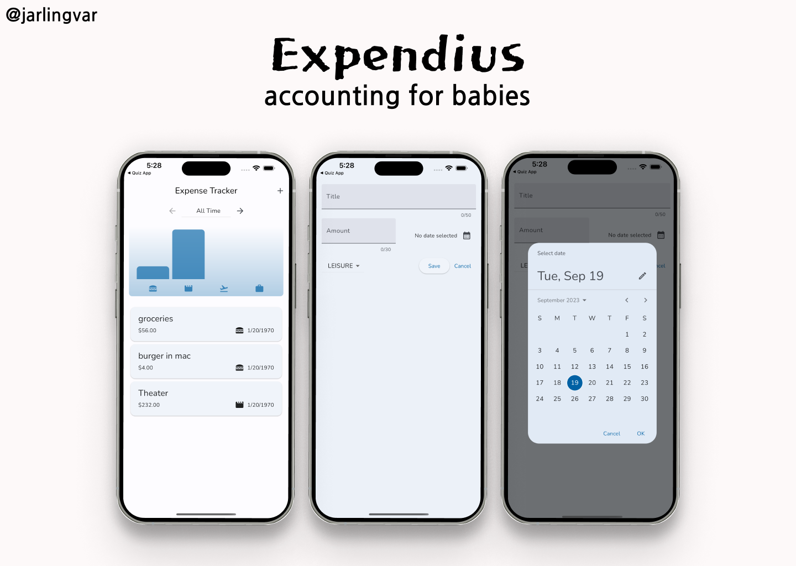

# Expendius

Flutter Expenses App – by [@jarlingvar](https://github.com/jarlingvar)

## Packages in use 📦

These are the main packages used in the app:
- [Google Fonts](https://pub.dev/packages/google_fonts) to use fonts from https://fonts.google.com/
- [Flex Color Scheme](https://pub.dev/packages/flex_color_scheme) to make AWESOME Flutter Material Design themes
- [Intl](https://pub.dev/packages/intl) for date formatting
- [SQFLite](https://pub.dev/packages/sqflite) for persistence

